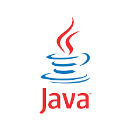
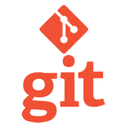
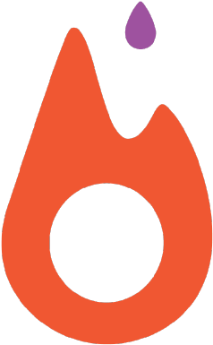

  &nbsp;&nbsp;
  &nbsp;&nbsp;
  

<h1 align="center">👋 Hello, I'm Towhid Ahmed Foysal</h1>

  

  <strong>Software Engineer @ Orbitax | AI Developer | Prompt Engineer</strong> 
  Passionate about Problem Solving, NLP Research, and AI Engineering

 

  <code>
  I'm Towhid Ahmed Foysal, a Competitive programmer and NLP researcher.I am a Software Engineer at Orbitax, which is one of the biggest International tax software Industries in the world. I have a great passion in <strong>Problem Solving and Natural Language Processing Research</strong>. </code>

  
  
  

### 🔭 Current Projects

- **XatBot**: Leading the development of an Enterprise-Grade Conversational AI Assistant
  - Stack: Azure OpenAI Service, Azure Cognitive Search, Azure Bing Search API, Anthropic Claude, 
    LangChain, ChromaDB, FastAPI, Redis Cache, Docker
  - Features: RAG Implementation, Multi-Modal Processing, Enterprise Security Integration

- **Visual Studio Extension**: Crafting an AI-Powered Development Assistant
  - Stack: C#, .NET, Visual Studio SDK, OpenAI API, WPF
  - Features: Real-time Code Completion, Automated Refactoring, Test Generation

- **AI Engineering Research**: Curating and Maintaining "How to Master AI Engineering" Repository
  - Focus: Best Practices, Architecture Patterns, Performance Optimization
  - Topics: LLM Integration, Prompt Engineering, Vector Databases

### 🛠️ Current Tech Stack

  
  
  
  

  
  
  

 

 
 ✇ <b>Competitive Programmming</b>: 

 
<h2 align="center">ONLINE JUDGE</h2>

  
  
  
  
  

  
  
  

  
  
  
  
  

  
    

 

 
 ✇ <b>Research Area</b>: 

 
<h2 align="center">RESEARCH</h2>

  
   
  
  
    

 

 
 ✇ <b>Skills</b>: 

 

<h2>
  <code>
    Preferred Languages
  </code>
</h2>
 

  
  
  
  
  

 
<h2>
  <code>
    Integrated Development Environment(IDE)
  </code>
</h2>
 

  
  
  
  
  
  

<h2>
  <code>
    Database
  </code>
</h2>
 

 
 
 

<h2>
  <code>
    Tools Used
  </code>
</h2>

 
 
 
 

 

 
 ✇ <b>Current Status</b>: 

 
- 🌱 I'm currently working on <code>XatBot - Enterprise-Grade Conversational AI Assistant</code>  
- 🚀 Leading development of <code>AI-Powered Visual Studio Extension</code>  
- 📚 Maintaining <code>How to Master AI Engineering Repository</code>  
- 💡 Specializing in <code>LLM Integration, RAG Systems, and Prompt Engineering</code>  
- 🔧 Working with <code>Azure OpenAI, LangChain, FastAPI, .NET, Docker</code>  
- 👯 I'm looking to collaborate on <code> Bangla NLP toolkit(sbnltk) </code>  
- 🕸️ Ask me about <code> Problem Solving and Deep learning </code>  
- 🌀 Trying to blog at <code> github </code>  
- 💬 You can reach me <code> towhidfoysal123@gmail.com </code>  
- ⚡  Gaming: COD, PUBG ,Valorant and Fall Guys

 
 ✇ <b>My Github Stats</b>: 

 

  
  

 

 
 ✇ <b>Publications</b>: 

 

 1. <a href="https://ieeexplore.ieee.org/document/9667900"> Bangla Extractive Text Summarization </a>

 
🔬 <b>Research & Expertise</b>

 

  
  
  
  

 
📫 <b>Connect With Me</b>

 

  📧 Email: towhidfoysal123@gmail.com 
  💼 LinkedIn: <a href="https://www.linkedin.com/in/towhid-ahmed-67476818b/">Towhid Ahmed Foysal</a>

